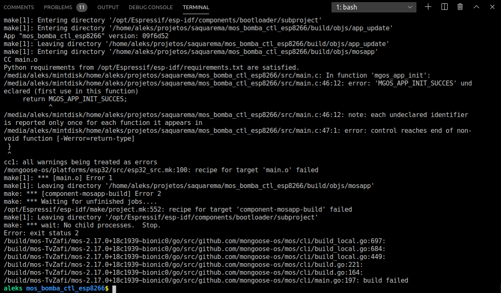
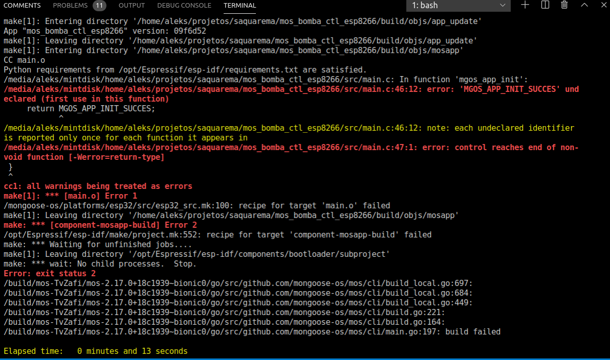
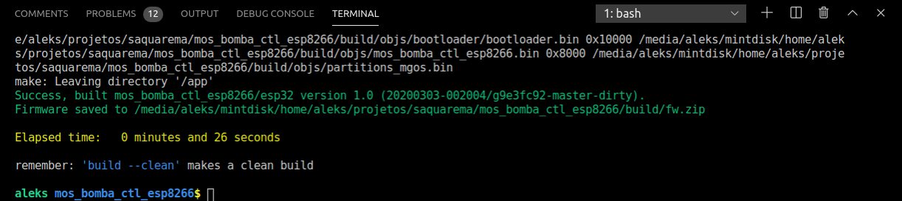
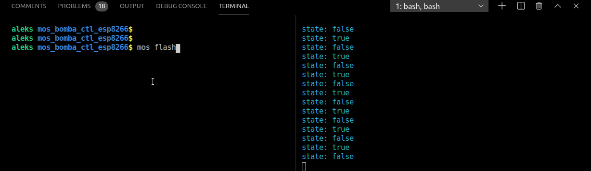
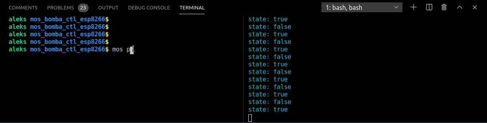
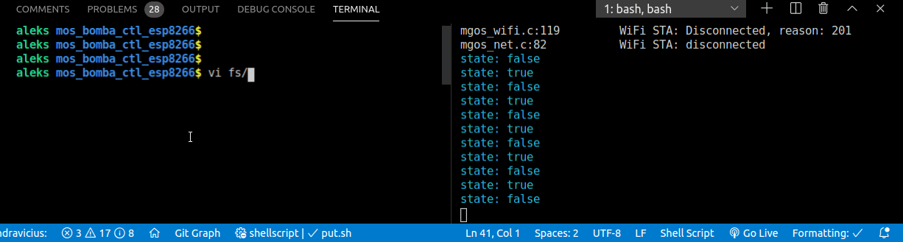
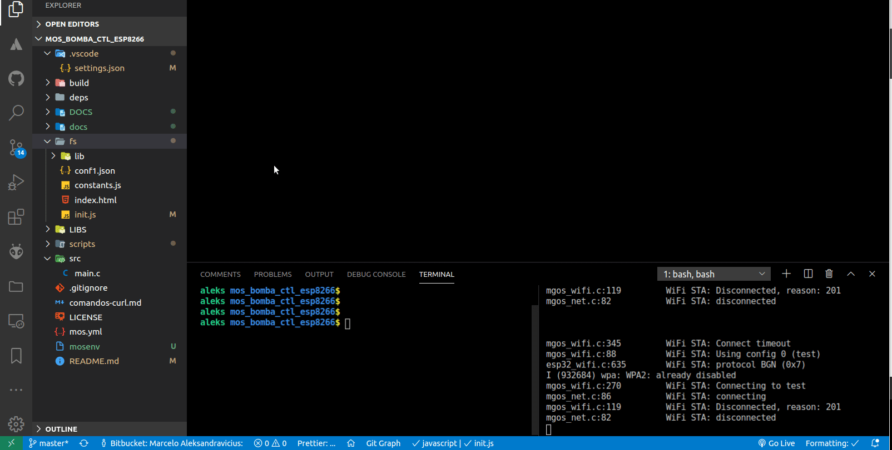

# IOT development with mongoose-os and super powers!

[TOC]

Mongoose-os is really a good framework and, as they say, you can prototype very fast, but it lacks of a better 'structure' to develop, so the time you save prototyping, some times you spend searching the error and managing serial and the file uploading. 

The tools i developed are merely some bash scripts, so it will not work on windows computers. 

The tools and some shortcuts you define  makes vscode the best IDE for microcontroller development. The code here brings you:

* run local builds (errors emphasized).
* upload the firmware while serial monitor is open.
* Save any file(s) inside fs folder (fs/*.*) and get it automatically transferred to the MCU.
* etc

All the scripts are located in the folder with the same name. 

### build

With this in mind, the first challenge was to help me find the errors when building **locally ** the firmware. Remote build tooks a lot of time,  so i made a build script to compile locally and to show errors in danger color and warnings in yellow. it's not yet such a big deal, but it was a step forward.  

So, we go from this:


to this:


And vscode interprets all file paths as hiperlinks. So, to correct the code you just need to press ctl+click over the error line and the file will be opened in the editor area. Cool!

After you make all the corrections and the code compiles ok, a green line will tell you that you had success; The build time is even shown too:



### flash
The problem about the original '**mos flash**' is that we *always* need to remember to stop the serial monitor before running the command; if we do not, the new firmware will not be flashed. It is not a specific mongoose-os problem but a a communication issue that disturb the fast development.

In the development process it is really annoying and i always forgot to stop the serial monitor before flashing or sending some file.

The video below shows the serial monitor being interrupted to do not disturb the file transfer. Below you see two terminals . On the right one, is running the tool i named **serial** and on the left is where i enter the command to flash a new firmware.




### put

As said above the command 'mos put' has problems when the serial monitor is running. Sometimes it works, but in the most part of times it presents trouble.



### mos2
The mos2 command is an encapsulation of the mos tool, so you can run any mos command knowing that it will work smoothly while usb port was opened by the serial monitor.

### serial
serial command also comes with some (custom/color)ization. When a line containing the string error is printed out all the line color will be changed to red. So identify errors become easier. In the video below, you see the fs/init.js file being edited introducing an error, so when the mjs interpreter print out the error in gets becomes very much more visible.




### watchfs
Its another little tool to observe the fs folder, so when any file inside this folder gets updated, it will automatically be sent to the MCU.

You can run it by opening another terminal or just installing the command-runner extension.

```json
  "command-runner": {
    "showRunCommandInEditorContextMenu": "false",
    "commands": {
      "mongooseos - watch fs directory": "${workspaceFolder}/scripts/watch.sh fs"
    }
  },
```





> Now, develop with mongoose-os is much more productive and fun !-D


### Todo:
  1. Make tools wifi.
  

### References:
  1. https://mongoose-os.com/
  1. https://github.com/npat-efault/picocom
  
  
### Apendix
```json
{
  //https: //marketplace.visualstudio.com/items?itemName=edonet.vscode-command-runner
  "command-runner": {
    "showRunCommandInEditorContextMenu": "false",
    "commands": {
      "mos reboot": "mos call Sys.Reboot",
      "mos2 - watch fs directory": "${workspaceFolder}/scripts/watch.sh fs",
      "mos2 - reboot": "mos2 call Sys.Reboot",
    }
  },
  //
  //sets the environment variable  where scripts are located
  "terminal.integrated.env.linux": {
    "MOS_SCRIPTS": "${workspaceFolder}/scripts"
  },
  //
  //On each terminal open (bash), Will first run the script to set up the aliases. 
  "terminal.integrated.shellArgs.linux": [
    "--init-file",
    "${workspaceFolder}/scripts/aliases.sh",
  ],
}
```


Marcelo Aleksandravicius - https://forensicdesk.com/developers
